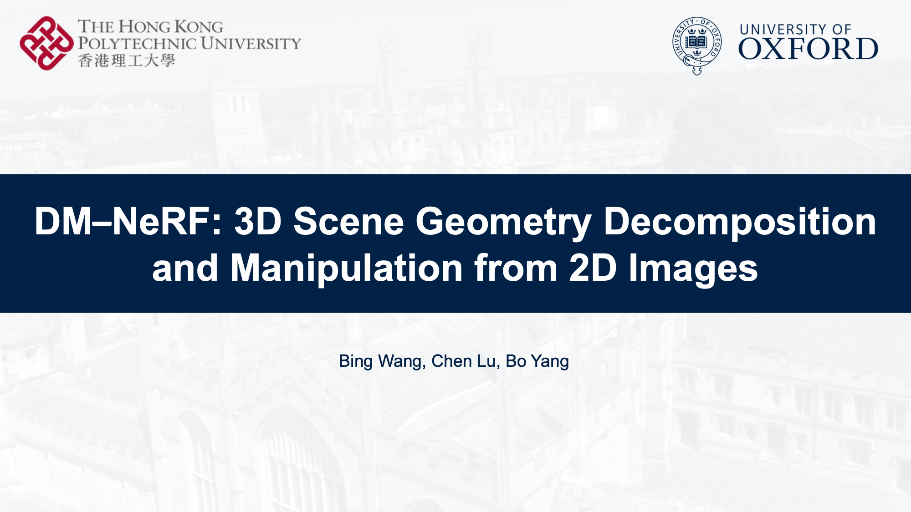

# DM-NeRF: 3D Scene Geometry Decomposition and Manipulation from 2D Images


This repository contains the implementation of the paper:

**DM-NeRF: 3D Scene Geometry Decomposition and Manipulation from 2D Images** <br />
[Bing Wang<sup>*</sup>](https://www.cs.ox.ac.uk/people/bing.wang/), [Lu Chen<sup>*</sup>](https://chenlu-china.github.io/), [Bo Yang](https://yang7879.github.io/) <br />
[**Paper**]() | [**Supplementary**]() | [**Video**](https://www.youtube.com/watch?v=yQtpPfM5dTA)

## Video (Youtube)
<p align="center"> <a href="https://www.youtube.com/watch?v=yQtpPfM5dTA"></a> </p>

## Decomposition and Manipulation:

<div align=center>
     &nbsp <br/></br>
</div>

## Qualitative Results

### Scene Decomposition
<div align=center>
      <br/></br>
     
</div>

### Object Manipulation

#### Rigid Transformation

<div align=center>
      <br/>
      <br/>
</div>

#### Deformable Manipulation

<div align=center>
      <br/>
</div>

## Instance 3D Reconstruction from Posed Images

<div align=center>
    <model-viewer 
        max-camera-orbit="Infinity 157.5deg 30m" 
        orientation="0deg -60deg 0deg" 
        camera-orbit="0deg 75deg 17m" 
        alt="Instance Reconstruction from Posed Images" 
        src="/figs/ins_mesh_study.glb" 
        poster="img/sem_room0_poster.png" 
        style="width: 100%; height: 600px; background-color: #404040" 
        exposure=".8" 
        auto-rotate="" 
        camera-controls="" 
        ar-status="not-presenting">
    </model-viewer>
</div>

## Installation

Create python >=3.7
```bash
pip install pytorch==1.8.1 torchVision==0.9.1 torchaudio===0.8.1
pip install -r environment.txt
```

## Datasets

To evaluate our model or train a new model from scratch, you have to obtain the respective dataset.
In this paper, we consider 3 different datasets:

DM-SR

Replica

ScanNet


## Training

After you set all parameters you want, you can train model use one of blow command, for example:

If you want use full of segementation function, you can run commands like:
```bash

CUDA_VISIBLE_DEVICES=0 python -u test_dmsr.py --config configs/train/dmsr/study.txt

```
If you do not segement emptiness area, you can delete `penalize` parameter in config file, and run above command.


## Evaluation

### Decomposition

We used PSNR, SSIM, LPIPS, and mAPs to evaluate our tasks:

For decomposition operation:

You need to add `render=True` and `log_time="your log folder name"` into config txt, and then run `CUDA_VISIBLE_DEVICES=7 python -u test_dmsr.py --config configs/test/dmsr/study.txt`.

### Manipulation

Manipulation operation includes two parts, evaluation and demo generation:

We only provide manipulated ground truth of DM-SR dataset for manipulation evaluation

Change `render = True` to `mani_eval = True`, and add 'target_label' and 'editor_mode' to assign which object manipulated and which manipulated operation 

you want, specific format can renference `./configs/manipulation/dmsr/editor_multi/study.txt`.

run 

```bash

CUDA_VISIBLE_DEVICES=0 python -u test_dmsr.py --config configs/train/dmsr/study.txt

```.

## Baseline

SOTA method Mask R-CNN

## Citation
If you find our work useful in your research, please consider citing:

## Acknowledgement

In this project we use (parts of) the implementations of the following works:

- [nerf_pytorch](https://github.com/yenchenlin/nerf-pytorch) by Yen-Chen Lin.
- [ScanNet](https://github.com/ScanNet/ScanNet) by Angela Dai.
- [3D-BoNet](https://github.com/Yang7879/3D-BoNet) by Bo Yang.
- [Semantic-NeRF](https://shuaifengzhi.com/Semantic-NeRF/) by Shuaifeng Zhi.
- [Mask R-CNN](https://github.com/matterport/Mask_RCNN) by Kaiming He.

We thank the respective authors for open sourcing their methods. 
