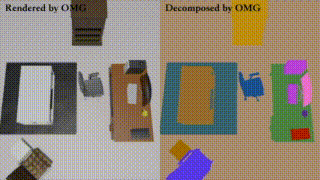

# OMG: 3D Scene Geometry Decomposition and Manipulation from 2D Images


This repository contains the implementation of the paper:

**OMG: 3D Scene Geometry Decomposition and Manipulation from 2D Images** <br />
[Bing Wang](https://www.cs.ox.ac.uk/people/bing.wang/), [Lu Chen](https://chenlu-china.github.io/), [Bo Yang<sup>*</sup>](https://yang7879.github.io/) <br />
[**Paper**]() | [**Supplementary**]() | [**Video**]()

**Demo:** <br />

|    |  |
| --------------------------------------- | ------------------------------------- |
|    |  |
|    |  |

<!-- <div align=center>
      <br/></br>
     <strong><center>Reconstruction and Instances Decomposition</center></strong>     <br/><br/>

</div>

<div align=center>
       <br/></br>
     <strong><center>Objects Manipulation</center></strong>     <br/><br/>
</div>

<div align=center>
       <br/></br>
       <br/></br>
       <br/></br>
     <strong><center>View Transformation and Objects Manipulation</center></strong>     <br/><br/>
</div> -->


## Installation

Create python environment vision >=3.7
```bash
pip install pytorch==1.8.1 torchVision==0.9.1 torchaudio===0.8.1
pip install -r environment.txt
```

## Datasets

To evaluate our model or train a new model from scratch, you have to obtain the respective dataset.
In this paper, we consider 3 different datasets:

### Scannet

If you need all the pre-processed files of ScanNet, you can access licenses of [ScanNet](https://github.com/ScanNet/ScanNet).

We used `scene0010_00, scene0012_00, scene0024_00, scene0033_00, scene0038_00, scene0088_00, scene0113_00, scene0192_00`.


### Replica

We used `office0, office2, office3, office4, room0, room1, room2`.


### OMG-SR（Ours）

Our dataset rendered by Blender(v2.82.7). It contains 8 normal kinds of indoor scenes, which are `Bathroom, Bedroom, Dinning, Kitchen, Reception, Rest, Study, Office`.

### Hints

Baisc information of each scenes can renference `./configs/0000/xxxx/xxxx.txt`.

## Training

You can change the your path and parameters under `./configs/xxxx/dataset_name/scene_name.txt`.

After you set all parameters you want, you can train model use one of blow command, for example:

For scannet:

If you want use full of segementation function, you can run commands like:
```bash

CUDA_VISIBLE_DEVICES=0 python train_scans.py --config configs/0050/scene0010_00.txt
or use nohup:
CUDA_VISIBLE_DEVICES=0 nohup python -u train_scans.py --config configs/0050/scene0010_00.txt > logs_0050/scene0010_00.txt 2>&1 &

```
If you do not segement non-occupied area, you can delete `penalize` parameter in config file, and run above command.


## Testing and Editor Testing

For 2D testing, we used PSNR, SSIM, LPIPS, and mAP to evaluate our task:

You need to add `render=True` and `log_time="your log folder name"` into config txt, and then run `CUDA_VISIBLE_DEVICES=0 python test_xxxx.py --config test_configs/0050/scene_name.txt`.

For editor testing:

Change `render=True` to `editor =True`, and eidt a object_info.json to assign objects you want to edior, specific format can renference `./editor_configs/sr/office_study.txt` and `./data/sr/office_study/object_info.json`.

run `CUDA_VISIBLE_DEVICES=0 python editor_test_xxxx.py --config editor_test_configs/0050/scene_name.txt`.

## Baseline

SOTA method Mask R-CNN

## Qualitative Results

<div align=center>
      <br/></br>
</div>

## Camera and Object Rotating

<div align=center>
      <br/></br>
</div>

## Citation
If you find our work useful in your research, please consider citing:

## Acknowledgement

In this project we use (parts of) the implementations of the following works:

- [nerf_pytorch](https://github.com/yenchenlin/nerf-pytorch) by Yen-Chen Lin.
- [ScanNet](https://github.com/ScanNet/ScanNet) by Angela Dai.
- [3D-BoNet](https://github.com/Yang7879/3D-BoNet) by Bo Yang.
- [Semantic-NeRF](https://shuaifengzhi.com/Semantic-NeRF/) by Shuaifeng Zhi.
- [Mask R-CNN](https://github.com/matterport/Mask_RCNN)by Kaiming He.

We thank the respective authors for open sourcing their methods. 
